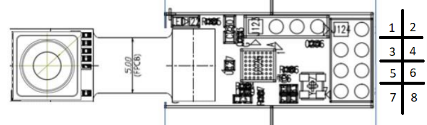

# NanoLambda library with examples!
### (Examples are modified for the Arduino MKR Series!)
All example codes have been modified to work with the Arduino MKR boards, but nanoLambda has developed all the code.  
Example FYS203 has been developed by Eik Lab with code from other examples.   

### License
All code is licensed under "Apache license 2.0", which means all code can be modified and used under all circumstances as long as the copyright holders are kept.

## How to's
### Install the library!

  1. Press the green "Code" button and download as a zip.
  2. Exctract the files and compress only the "NanoLambdaNSP32_FYS203" as zip.
  3. Open Arduino IDE, press "Sketch" -> "Include library" -> "Add ZIP-library" and choose the zipped NanoLambdaNSP32_FYS203_FYS203 folder.
  4. Restart the Arduino IDE.

The examples should now appear in "File" -> "Examples" -> "NanoLambdaNSP32".  

### Connect the NSP32m
  

#### Connect the cables from the NSP32m to these pins on Arduino (see image above)
  1. -> VCC
  2. -> 14 TX
  3. -> GND
  4. -> NC (Not connected)
  5. -> 1
  6. -> NC (Not connected)
  7. -> 0
  8. -> 13 RX

Nanolambda will light a green diode, if the power is connected correctly. 
See the datasheet for more information!  

### Compile and run an example

  1. Choose an example
  2. Choose correct board. Goto "Tools" -> "Board" and select a board
  3. Choose correct port. Goto "Tools" -> "Port" and select a port, often named "COMXX(Board name)"
  4. Press the right arrow in the Arduino IDE (next to the check icon), and it will compile, load the code into the board and run the code.

  Most example codes will write comments in a monitor, these can be found under "Tools" -> "Serial Monitor"
